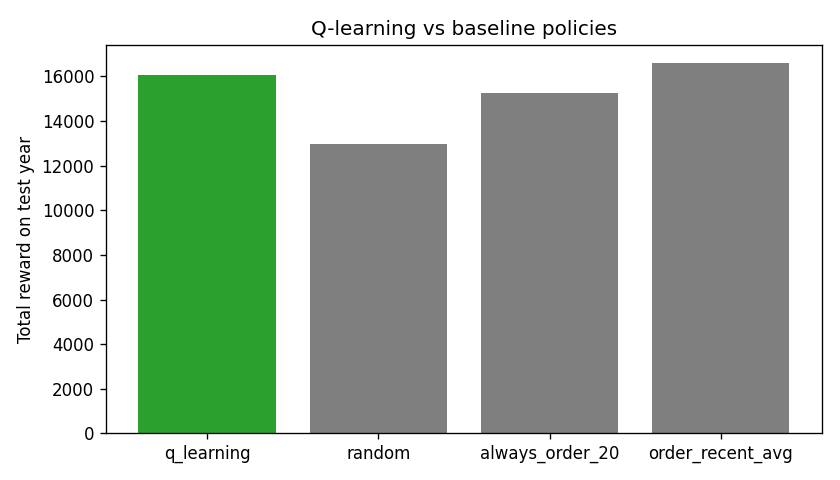
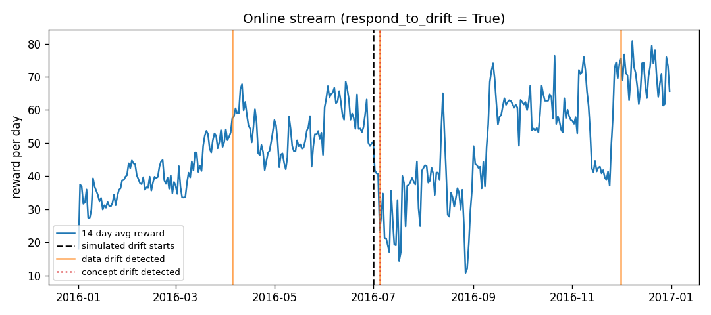

# Inventory Restocking Agent

A reproducible machine learning project that uses tabular Q-learning to decide
how many units a shop should reorder each day. DVC manages the data, pipeline,
model, metrics and plots.

The project also includes River online learning, ADWIN drift detection and a
Feast feature store.

## Problem

Ordering too little causes lost sales, while ordering too much increases
holding costs. The agent learns a restocking policy from historical daily
demand.

- Dataset: Kaggle Store Item Demand Forecasting Challenge
- Selection: store 1, item 1
- Period: 2013-2017
- Rows: 1,826
- Train: 2013-2015
- Online stream: 2016
- Test: 2017

The split is chronological to prevent future information from leaking into
training.

## Model

The agent uses tabular Q-learning with epsilon-greedy exploration.

- State: stock bucket, day of week and demand trend
- Actions: order 0, 10, 20 or 40 units
- Reward: revenue minus ordering, holding and stockout costs
- Model output: `models/q_table.json`

## Pipeline

```text
data/raw/sales.csv.dvc
          |
       prepare
       /     \
    train     \
    /   \      \
evaluate  online_drift  feast_serve
```

| Stage | Purpose | Main output |
|---|---|---|
| `prepare` | Clean data, build features and create chronological splits | `data/processed/*.parquet` |
| `train` | Train the Q-learning policy | `models/q_table.json` |
| `evaluate` | Compare the policy with three baselines | `metrics/eval.json` |
| `online_drift` | Run online learning and drift response | `metrics/drift.json` |
| `feast_serve` | Validate offline and online feature retrieval | `metrics/feast.json` |

View the pipeline with:

```powershell
dvc dag
```

## Project Structure

```text
data/             Raw DVC data pointer and processed datasets
feature_repo/     Feast feature definitions and local store configuration
metrics/          Training, evaluation, drift and Feast metrics
models/           Trained Q-table
results/          Evaluation and drift plots
src/              Pipeline source code
tests/            Smoke tests
tools/            Dataset import and generation utility
dvc.yaml          DVC pipeline definition
params.yaml       Pipeline and model parameters
```

## Setup

Python 3.11 is recommended.

```powershell
git clone https://github.com/Az-main/Q-learning-MLSD-Project-Feast.git
cd Q-learning-MLSD-Project-Feast

py -3.11 -m venv .venv
Set-ExecutionPolicy -Scope Process -ExecutionPolicy RemoteSigned
.\.venv\Scripts\Activate.ps1

python -m pip install --upgrade pip
python -m pip install -r requirements.txt
python -m pip install -r requirements-feast.txt
```

For a private DagsHub repository, configure your own credentials locally:

```powershell
dvc remote modify origin --local auth basic
dvc remote modify origin --local user YOUR_DAGSHUB_USERNAME
dvc remote modify origin --local password YOUR_DAGSHUB_TOKEN
```

The token is stored in `.dvc/config.local`, which is ignored by Git.

## Reproduce

```powershell
dvc pull
dvc status
dvc repro
dvc metrics show
python tests/smoke_test.py
```

`dvc repro` checks the dependency and parameter hashes recorded in `dvc.lock`
and runs only stages affected by a change.

## Results

### Policy evaluation

| Policy | Total reward | Service level | Stockout rate | Average leftover |
|---|---:|---:|---:|---:|
| Q-learning | **18,197.3** | 0.860 | 0.466 | **3.92** |
| Recent-average order | 16,589.1 | 0.887 | 0.337 | 26.47 |
| Always order 20 | 15,258.0 | 0.866 | 0.381 | 27.75 |
| Random | 12,979.6 | 0.813 | 0.268 | 27.28 |

The learned policy achieved the highest reward while keeping less unused
inventory than the baseline policies.



### Drift response

| Metric | Response enabled | Response disabled |
|---|---:|---:|
| Average daily reward after drift | 51.51 | 13.66 |
| Online total reward | 17,498.2 | 10,493.5 |
| Retraining events | 3 | 0 |



## Bonus Components

### Online learning and drift detection

River updates a demand forecaster one observation at a time. ADWIN monitors
demand values for data drift and prediction errors for concept drift. When
enabled, the policy adapts by replaying the most recent stream window.

### Feast feature store

Feast uses Parquet for historical feature retrieval and SQLite for low-latency
online retrieval. The feature view contains day of week, rolling demand and
demand trend.

```powershell
dvc repro feast_serve

Push-Location feature_repo
feast feature-views list
Pop-Location

Get-Content metrics\feast.json
```

The verified feature view is `AVAILABLE_ONLINE`, and historical Feast values
match the processed source data.
