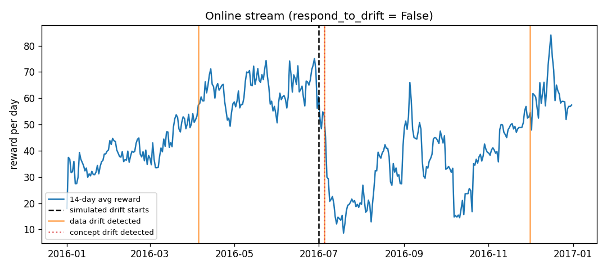

# Inventory Restocking Agent - Feast Edition

A tabular Q-learning agent that decides how much stock to reorder each day,
built as a reproducible DVC pipeline. Bonus components include River online
learning, ADWIN drift detection with automatic retraining, and a Feast feature
store with offline and online feature retrieval.

## Problem and Dataset

A shop must decide every day how many units to order. Ordering costs money,
leftover stock creates holding costs, and running out of stock loses sales.

- **Dataset:** Kaggle *Store Item Demand Forecasting Challenge*, store 1/item 1
- **Size:** 1,826 daily rows from 2013 through 2017
- **Training period:** 2013-2015
- **Online stream period:** 2016
- **Test period:** 2017
- **Synthetic alternative:** `tools/get_data.py` can generate data when Kaggle data is unavailable
- **Simulated drift:** demand is multiplied by `drift_factor` from 2016-07-01
- **Data split:** chronological and never shuffled

## ML Model

The project uses tabular **Q-learning** with epsilon-greedy exploration.

- **State space (168):** stock bucket (8) x day of week (7) x demand trend (3)
- **Actions:** order 0, 10, 20, or 40 units
- **Reward:** `5*sold - 2*ordered - 0.3*leftover - 2*unmet`
- **Learning rate:** 0.1
- **Discount factor:** 0.95
- **Training episodes:** 600
- **Main model output:** `models/q_table.json`

## Project Structure

```text
data/raw/sales.csv.dvc       Raw data pointer tracked by DVC
data/processed/              Prepared train, stream, and test datasets
src/                         Pipeline and model source files
feature_repo/                Feast feature definitions and configuration
tools/get_data.py            Dataset preparation utility
tests/smoke_test.py          Project sanity tests
models/q_table.json          Trained Q-learning policy
metrics/                     Training, evaluation, drift, and Feast metrics
results/                     Evaluation and drift plots
params.yaml                  Model and pipeline parameters
dvc.yaml                     DVC pipeline definition
dvc.lock                     Recorded pipeline hashes
requirements.txt             Main Python dependencies
requirements-feast.txt       Feast dependency
```

## DVC Pipeline

```text
data/raw/sales.csv.dvc -> prepare -> train -> evaluate

prepare + train -> online_drift
prepare + train -> feast_serve
```

| Stage | Inputs | Outputs |
|---|---|---|
| `prepare` | Raw sales data and preparation parameters | Train, stream, and test Parquet files |
| `train` | Training data and model parameters | Q-table, training metrics, and curve |
| `evaluate` | Q-table and test data | Evaluation metrics and policy comparison |
| `online_drift` | Q-table, stream data, and drift parameters | Drift metrics and online-drift plot |
| `feast_serve` | Processed data, Q-table, and feature definitions | Feast metrics and order recommendations |

## How to Run

The project requires **Python 3.11**. The commands below use Windows
PowerShell.

### 1. Clone and create the environment

```powershell
git clone https://github.com/Az-main/Q-learning-MLSD-Project-Feast.git
cd Q-learning-MLSD-Project-Feast

py -3.11 -m venv .venv
Set-ExecutionPolicy -Scope Process -ExecutionPolicy RemoteSigned
.\.venv\Scripts\Activate.ps1

python -m pip install --upgrade pip
python -m pip install -r requirements.txt
python -m pip install -r requirements-feast.txt
```

The second requirements file installs Feast for the feature-store bonus stage.

### 2. Configure DagsHub credentials

The project uses a shared DagsHub DVC remote. Each collaborator must configure
their own DagsHub username and access token:

```powershell
dvc remote modify origin --local auth basic
dvc remote modify origin --local user YOUR_DAGSHUB_USERNAME
dvc remote modify origin --local password YOUR_DAGSHUB_TOKEN
```

Replace the placeholders with your own credentials.

Credentials are stored in `.dvc/config.local`, which is ignored by Git. Never
commit this file or share your access token.

### 3. Download the DVC-tracked files

```powershell
dvc pull
```

This downloads the raw data, processed datasets, trained model, and other
DVC-tracked artifacts from DagsHub.

### 4. Verify and run the project

```powershell
dvc status
dvc dag
dvc repro
dvc metrics show
dvc plots show
python tests/smoke_test.py
```

Expected results:

- `dvc status` reports that the data and pipeline are up to date.
- `dvc repro` skips stages that have not changed.
- `dvc dag` displays all pipeline stages.
- The smoke tests pass.

The original `D:\dvcstore` remote is retained as a local backup on the original
development PC. DagsHub is the default shared remote.

## Feast Feature Store

The `feast_serve` stage demonstrates consistent feature retrieval for training
and serving.

### Feast components

- **Entity:** `store_item`, identified by `store_item_id`
- **Feature view:** `demand_features`
- **Features:** day of week, rolling demand, and demand trend
- **Offline store:** historical features stored in Parquet
- **Online store:** latest feature values stored in SQLite
- **Materialization:** copies feature values from the offline store to the online store

Run and inspect the Feast stage:

```powershell
dvc repro feast_serve

Push-Location feature_repo
feast feature-views list
Pop-Location

Get-Content metrics\feast.json
```

The Feast validation produced:

| Result | Value |
|---|---|
| Historical rows retrieved | 5 |
| Historical values match source | True |
| Feature view state | `AVAILABLE_ONLINE` |
| Store-item ID | 1001 |
| Latest day of week | 6 |
| Latest rolling demand | 17.57 |
| Latest demand trend | 1 |
| Recommended order with stock 0 | 10 |
| Recommended order with stock 20 | 10 |
| Recommended order with stock 60 | 0 |

The generated Feast registry, SQLite database, and Parquet files are stored
under `feature_repo/data/`. They are ignored by Git because the stage can
regenerate them.

## Results

### Policy Evaluation

| Policy | Total reward | Service level | Stockout rate | Average leftover |
|---|---:|---:|---:|---:|
| **Q-learning** | **18,197.3** | 0.860 | 0.466 | **3.92** |
| Recent-average order | 16,589.1 | 0.887 | 0.337 | 26.47 |
| Always order 20 | 15,258.0 | 0.866 | 0.381 | 27.75 |
| Random policy | 12,979.6 | 0.813 | 0.268 | 27.28 |

The Q-learning agent achieved the highest total reward and kept substantially
less unused inventory than the comparison policies.

With `gamma: 0`, the agent never orders because ordering costs money immediately
while its benefit appears on a later day. This produced a total reward of about
-16,054 and a service level of approximately 0.2%.


### Drift Response Comparison

The conditions before the simulated drift are nearly identical. After the
demand increase, automatic retraining substantially improves performance.

| Metric | Response enabled | Response disabled |
|---|---:|---:|
| Average daily reward before drift | 44.07 | 43.84 |
| Average daily reward after drift | 51.51 | 13.66 |
| Online total reward | 17,498.2 | 10,493.5 |
| Retraining events | 3 | 0 |

The final project configuration uses:

```yaml
drift:
  respond: true
```

#### Response Enabled


#### Response Disabled



## Collaboration Workflow

Before starting work:

```powershell
git switch main
git pull
dvc pull
git switch -c username/short-task-name
```

After changing code, parameters, data, or pipeline outputs:

```powershell
dvc repro
dvc push
git status
git add .
git commit -m "Describe the change"
git push -u origin HEAD
```

Then create a GitHub pull request, review the changes, merge them into `main`,
and delete the completed branch.

Each contributor should use their own Git branch and DagsHub access token.
Avoid editing the same files on both computers at the same time.

## Main Limitations

- The inventory environment is a simplified simulator.
- Orders are delivered overnight.
- Prices and costs are fixed.
- The main drift event is simulated by multiplying demand.
- ADWIN can also detect natural seasonal changes.
- Q-learning results can vary slightly with the random seed.